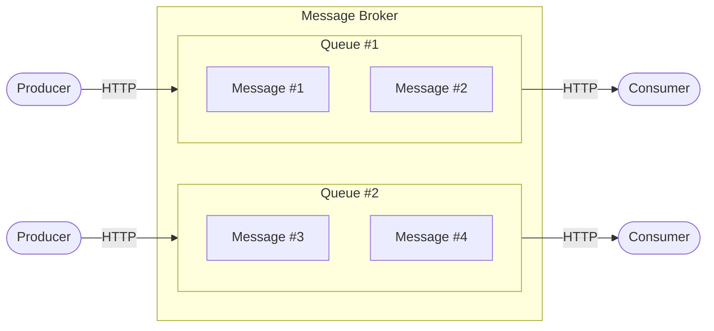

# Simple Message Broker

This repository is part of the [Concurrency in Go (7th stream)](https://balun-team.yonote.ru/share/87f296a0-48fa-44e0-b8ca-d0eea9d67a71/doc/samostoyatelnaya-rabota-vt5nM6MfRE) course assignment.

## Overview

The Simple Message Broker is an in-memory broker that manages multiple queues.

* **Queue lifecycle:** Queues are defined at startup via config file, environment variables, or CLI arguments. They cannot be added or removed at runtime.
* **Queue configuration:** Each queue has a fixed size and a unique key. Both are specified during startup.
* **Message storage:** Messages are kept in memory only — **no disk persistence**.
* **Message format:** Any arbitrary JSON payload.
* **Delivery:** Messages are delivered to all subscribers of the target queue. If no subscribers exist, messages remain in the queue until one subscribes.
* **Limits:** Each queue has a maximum size and a configurable subscriber cap.

### API

The broker exposes a minimal HTTP API:

```
POST /v1/queues/{queue_name}/messages        # Send a message
POST /v1/queues/{queue_name}/subscriptions   # Subscribe to a queue
```

### Example

Let's say the `app_events` queue has three subscribers. A message was sent to it:

```json
{"event": "delivered"}
```

The message will be delivered to all three subscribers.
Subscribers of other queues will not receive it.

---

## Architecture



---

## Running

```bash
# With TUI (default)
go run cmd/broker/main.go

# Without TUI
go run cmd/broker/main.go -tui=false

# Using a config file (lowest priority, can be overridden by ENV/CLI)
go run cmd/broker/main.go -config=config.json

# Custom port (via CLI)
go run cmd/broker/main.go -port=9090
```

### Configuration Priority

From lowest to highest:

1. Config file
2. Environment variables (ENV)
3. CLI arguments (the highest priority)

#### Example: ENV

```bash
export VSMB_QUEUES="chat,logs,emails"
export VSMB_PORT=9090
export VSMB_TUI=false
export VSMB_QUEUE_SIZE=2000
export VSMB_QUEUE_MAX_SUBS=20

go run cmd/broker/main.go
```

#### Example: CLI

```bash
go run cmd/broker/main.go \
  -queues="chat,logs,emails" \
  -queue-size=2000 \
  -queue-max-subs=20 \
  -port=9090 \
  -tui=false
```

---

## API Endpoints

* `POST /v1/queues/{queue_name}/messages` – send a message
* `POST /v1/queues/{queue_name}/subscriptions` – subscribe to a queue (via SSE)
* `GET /stats` – broker statistics
* `GET /health` – health check

---

## Usage Examples

### Send a message

```bash
curl -X POST \
  -H "Content-Type: application/json" \
  -d '{"event":"user_registered","user_id":123}' \
  http://localhost:8080/v1/queues/app_events/messages
```

### Subscribe (SSE, live-only)

```bash
curl -N \
  -H "Accept: text/event-stream" \
  http://localhost:8080/v1/queues/app_events/subscriptions

```

### Get statistics

```bash
curl http://localhost:8080/stats
```

---

## TUI Interface

The built-in TUI provides a live dashboard:

* All queues
* Messages per queue
* Subscriber count
* Total processed messages
* Last activity time
* Queue status: **Active / Idle / Inactive**

### Controls

* `q` — quit
* `r` — refresh stats
* `↑ / ↓` — navigate

---

> Producers and consumers can be as simple as `curl` or Postman requests, or you can build your own CLI tools on top of the broker API.
