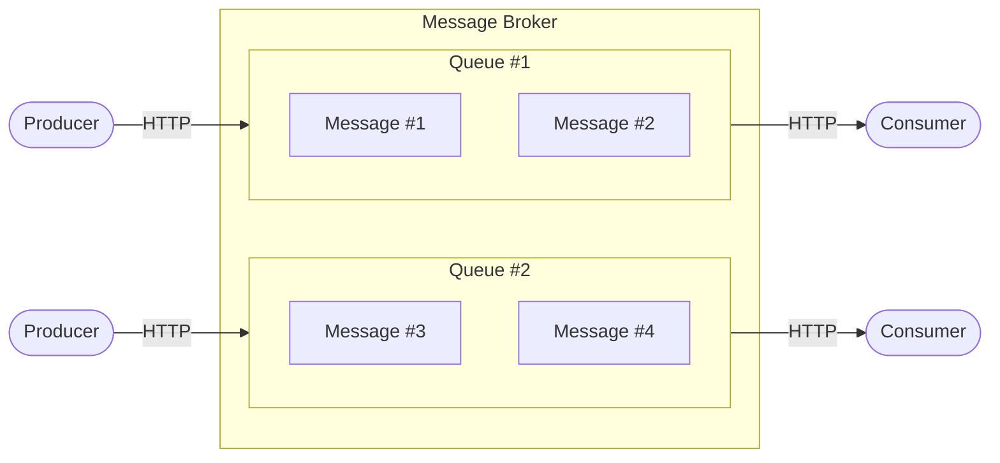

# Simple Message Broker

Данный репозиторий является частью [самостоятельной работы](https://balun-team.yonote.ru/share/87f296a0-48fa-44e0-b8ca-d0eea9d67a71/doc/samostoyatelnaya-rabota-vt5nM6MfRE) по курсу Concurrency в GO (7 поток).

## Условия самостоятельной работы

### Описание брокера сообщений:
Брокер сообщений будет представлять собой приложение, внутри которого будет множество очередей. Очереди создаются при 
старте приложения через конфигурационный файл, переменные окружения или аргументы командной строки (*во время исполнения
приложения нельзя добавлять и удалять очереди*). Каждая очередь должна быть фиксированного размера, а также с ней должно
ассоциироваться уникальное название, при помощи которого можно будет взаимодействовать с очередью (*размер очереди и 
ключ также конфигуриуется при старте приложения*). Сообщения в очередях будут храниться в оперативной памяти - **ничего 
на диск записывать не нужно**. Сообщения могут представлять собой абсолютно любые данные, сериализованые в формате JSON.

__У брокера сообщений будет крайне простой API__ — можно отправить сообщение в конкретную очередь, либо создать подписку на конкретную очередь.

```
POST ${address}/v1/queues/${queue_name}/messages
POST ${address}/v1/queues/${queue_name}/subscriptions
```

При отправке сообщения в очередь, сообщение должно быть доставлено всем подписчикам этой очереди. Сообщение удаляется 
после того, как оно будет доставлено всем подписчикам. Если подписчиков нет, то сообщения хранятся в очереди до тех пор,
пока не появятся подписчики. Если очередь переполнена, то брокер сообщений должен вернуть ошибку клиенту при отправке 
сообщения. Подписчиков у очереди должно быть ограниченное количество (ограничение конфигурируется при старте).

> Например, если на очередь app_events подписано три подписчика, то при отправке сообщения `{“event”: ”delivered”}` в эту 
очередь — три подписчика должны будут получить это сообщение. Если есть еще другие подписчики, которые подписаны на 
другие очереди, то они не должны получать сообщений из очереди `app_events`.

### Архитектура брокера сообщений:



> В качестве Producer и Consumer можно использовать curl и Postman, либо написать свои собственные CLI приложения для 
взаимодействия с брокером сообщений.

## Запуск

```bash
# С TUI интерфейсом (по умолчанию)
go run cmd/broker/main.go

# Без TUI
go run cmd/broker/main.go -tui=false

# С конфигурационным файлом (низкий приоритет, может быть переопределён ENV/CLI)
go run cmd/broker/main.go -config=config.json

# На другом порту (через CLI)
go run cmd/broker/main.go -port=9090
```

### Переопределение списка очередей

Приоритет конфигурации (от низкого к высокому):
1) Конфигурационный файл
2) Переменные окружения (ENV)
3) Аргументы программы (CLI) — самый высокий приоритет.

#### Через ENV:
```bash
export VSMB_QUEUES="chat,logs,emails"
export VSMB_PORT=9090
export VSMB_TUI=false
export VSMB_QUEUE_SIZE=2000
export VSMB_QUEUE_MAX_SUBS=20

go run cmd/broker/main.go
```

#### Через CLI:
```bash
go run cmd/broker/main.go \
  -queues="chat,logs,emails" \
  -queue-size=2000 \
  -queue-max-subs=20 \
  -port=9090 \
  -tui=false
```

## API Endpoints

- `POST /v1/queues/{queue_name}/messages` - отправить сообщение
- `POST /v1/queues/{queue_name}/subscriptions` - подписаться на очередь
- `GET /stats` - получить статистику
- `GET /health` - проверка состояния

## Использование

### Отправка сообщения:
```bash
curl -X POST http://localhost:8080/v1/queues/app_events/messages \
  -H "Content-Type: application/json" \
  -d '{"event":"user_registered","user_id":123}'
```

### Подписка на очередь:
```bash
curl -X POST http://localhost:8080/v1/queues/app_events/subscriptions
```

### Получение статистики:
```bash
curl http://localhost:8080/stats
```

## TUI Интерфейс

В TUI отображается:
- Список всех очередей
- Количество сообщений в каждой очереди
- Количество подписчиков
- Общее количество обработанных сообщений
- Время последней активности
- Статус очереди (Active/Idle/Inactive)

Управление:
- `q` - выход
- `r` - обновить статистику
- `↑/↓` - навигация по таблице
